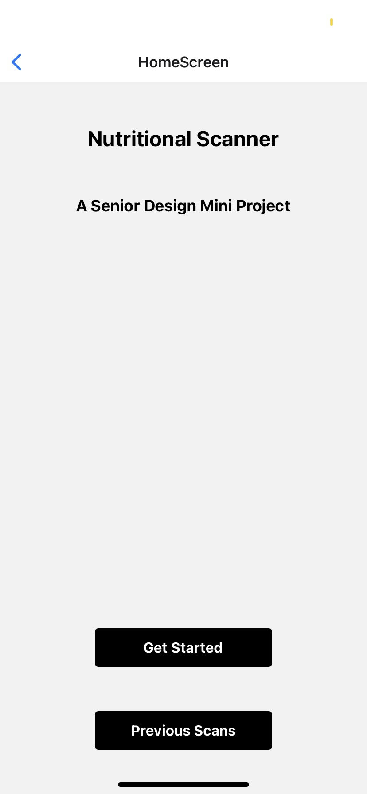
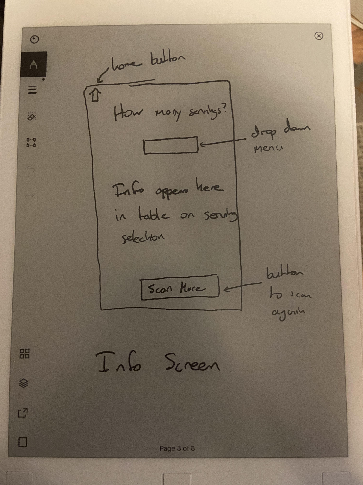

# EC463_MiniProject

## Team Members
- ### Benjamin Brewer
- ### Zixuan Shu

## Project Overview
The purpose of this app is for the user to scan food items with FDA barcodes and track calories throughout the day. Calories are counted by interacting with the FDA's FoodData Central API based on the barcode value, then asking the user for the number of servings. The users information and previous scans are stored in Google Firebase under their profile, and can be viewed from the history screen. 

 

## Tech Stack
| Frontend      | Backend |
| ----------- | ----------- |
|      |        |
| React Native  | Google Firebase       |

 

## UI Flow
### Log In & Registration
|Login            |  Registration|
|:-------------------------:|:-------------------------:|
|  |  |
Here the user can sign into an existing account or create one using register

 

### Home Screen

Here the user can click "Get Started" to begin scanning, or "Previous Scans" to see their history

 

### Camera

Here the user scans the barcode with the camera. It can be a numerical barcode as shown, or one that spells out a food name such as "banana". The user will be asked to confirm the barcode is correct.

 

### Results Screen

Here the user inputs the number of servings they're consuming. The name of the food and total calories based on the servings is displayed

 

### History Screen

Here the user can view all their previous scans, including the name, number of servings, and total servings. They also have the ability to delete an item by double clicking the "x" button if they added an item by accident
 
 

## Backend Set Up
 

### Authorization

Users are created with their email and stored using the Google Firebase Authentication feature

 

### Data Storage

Users scanned meals are saved in the Firestore database. They're organized through a collection of their meals, which contains documents for each scan they've performed. In these documents there are 5 fields of information:
- Calories (calories per serving)
- Food (name of the food)
- docID (Firestores auto generated ID for the scan)
- id (which number scan it is, starting at 0)
- servings (the number of servings from user input)

 

## Demo Video
 

 

## Planning Documentation
 

While most of our planning and work was communicated through text messages, we have pictures of our initial UI layout designs provided below

 

 
 

## Challenges

 

The main challenge of our project was smoothly integrating Firebase with React Native. This was mainly due to the fact that the firebase project was set up with a bu.edu domain. This meant we didn't have access to Google Cloud Platform and therefore were unable to enable gmail authentication, or other forms of social platform sign in. Furthermore, our React Native project was managed by Expo and tested on Expo Go, meaning the Firebase dependencies with the most documentation weren't helpful as Expo Go has specific requirements. 

 

## Future Features

 

Some features we would've liked to add or had plans on, but simply didn't have the time for are as follows:
- Date sorted meals
- Total daily intake counter
- Visibility of info beyond calories (i.e. carbs, sugars, fats, etc.)
- Meal collections, where you could scan multiple ingredients and categorize them as a meal
- Gmail and apple sign in/authentication
- Social platform sharing (autogenerate posts for socialmedia like, "*Username* made a meal with *ingredients* today!")
- A more consistent UI experience
- Ability to edit servings after scan is complete

This is by no means a comprehensive list, but shows some of the plans we had for this project which we didn't have time to implement